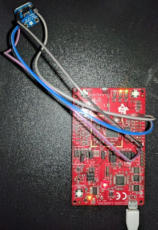

# HumidityTempIoT

A simple IoT application that captures the humidity and temperature using TI CC3200 WiFi Launchpad and Adafruit Si7021 breakout board, and sends the data to Exosite IoT platform where it can be visualized.

## Hardware

* [TI CC3200 WiFi Launchpad](http://www.ti.com/cc3200start)
* [Adafruit Si7021 breakout board](https://www.adafruit.com/products/3251)

To set-up, connect the I2C pins on breakout board to Pins P01 and P02 on CC3200 Launchpad.

## Software

* CC3200 SDK 1.1.0
* TI-RTOS for CC32xx 2.16.00.08
* XDCtools 3.32.00.06
* Code Composer Studio (CCS) v7.0
* Uniflash v3.4

Download and install these TI software.

## Usage

* Download and import the project into CCS.
* Open Config.h in CCS. This file contains the application specific configuration. Follow the instructions and update the file.
* Clean and build the project.
* Using Uniflash, flash the HumidityTempIoT.bin file and the 'ca.der' (Exosite Root CA) to '/cert/ca.der' on SFLASH.
* View the data on Exosite.

## My Exosite Dashboard:
https://portals.exosite.com/views/1669926570/2176285518
